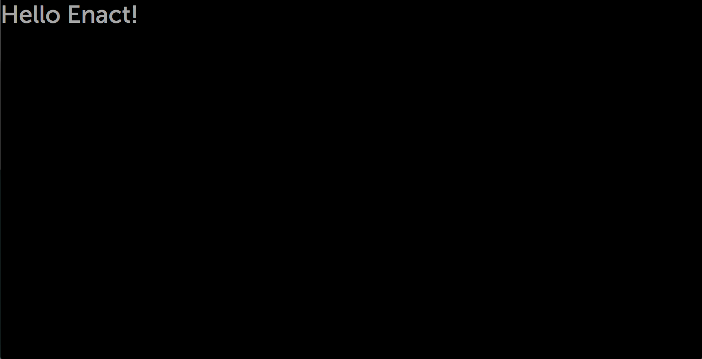

In the [last part of Hello Enact!](../kind/), we covered the benefits of SFCs
and introduced the `kind()` factory. In this final part, we'll discuss [Higher-order Components
](#higher-order-comopnents) (HoCs) and how the [`@enact/moonstone/MoonstoneDecorator`
HoC](#moonstonedecorator) can be used to quickly and easily add Moonstone styling and features to
our application.

## Higher-order Components

In the simplest sense, Higher-order Components (HoCs) are functions that accept React components and
return React components. They are useful for encapsulating common behavior, markup, and property
transformations, which can later be applied to other components as needed.

Enact provides several HoCs, as well as a factory method, `@enact/core/hoc`, to create
your own. All Higher-order Components within Enact support an optional configuration object to
customize their behavior. The first HoC we'll encounter is MoonstoneDecorator.

> If you are coming from a background in Enyo 2 (or many other frameworks), Higher-order Components
> may sound similar to mixins. While they are conceptually similar, HoCs provided better
> encapsulation, resulting in fewer clashes between the implementations of disparate features.
>
> Dan Abramov has [offered a good perspective](https://medium.com/@dan_abramov/mixins-are-dead-long-live-higher-order-components-94a0d2f9e750)
> on the change to React to deprecate mixin support that may be informative.

## MoonstoneDecorator

`@enact/moonstone/MoonstoneDecorator` is a Higher-order Component that adds moonstone styling and
several add-ons that are commonly used by moonstone applications: multi-resolution support,
internationalization support, and Spotlight support.

### Moonstone Styling

The first change you'll notice after applying MoonstoneDecorator is the color and font changes which
come from the `.moon` CSS class. Since Moonstone apps are designed to run full screen,
MoonstoneDecorator also applies the global utility class `.enact-fit`, which uses absolute
positioning to fill the available space.

### Multi-Resolution Support

Since Moonstone targets televisions that have different resolutions (720p, 1080p, 4k, and beyond!),
Enact provides a set of tools to enable scaling applications for a consistent layout across
resolutions. One part of the solution is [`less-plugin-resolution-independence`](https://github.com/enyojs/less-plugin-resolution-independence),
a LESS plugin that adapts pixel measurements to relative measurements. The second part is
`@enact/ui/resolution` which provides the capabilities to set the correct base size for the current
resolution as well as utilities to work with resolution independent measurements in components.

On top of this, Moonstone establishes a set of screen types for our supported television
resolutions that are configured for the application by MoonstoneDecorator.

### Internationalization Support

In order to support delivery of applications to multiple locales, Enact integrates with the [iLib](https://sourceforge.net/projects/i18nlib/)
internationalization library through our own module, `@enact/i18n`. This module provides the glue
between the two code bases to correctly load locale resources and expose the results within an Enact
app.

MoonstoneDecorator uses I18nDecorator, a HoC from the `@enact/i18n` module, to add the appropriate CSS
classes for the locale. I18nDecorator is also responsible for passing the `rtl` flag and
`updateLocale` method to the app via [React's context](https://facebook.github.io/react/docs/context.html).

### Spotlight Support

Moonstone applications must support 5-way navigation and selection to allow them to be used with only a
remote control. The `@enact/spotlight` module provides the logic to support this and it is bootstrapped
into a Moonstone app via MoonstoneDecorator and the SpotlightRootDecorator.

> All Moonstone components that should be navigable via 5-way already include the necessary support
> out of the box. If you build your own components, you may need to add your own spotlight support
> using Spottable from `@enact/spotlight`.

## Updating App.js

To use a Higher-order Component you've imported, pass another component (or DOM node name) to the
HoC, optionally including the configuration object. For MoonstoneDecorator, you can opt out of
internationalization, resolution independence, or spotlight support by setting `i18n`, `ri`, or
`spotlight` respectively to `false`. For our sample application, we will use the defaults.

	import MoonstoneDecorator from '@enact/moonstone/MoonstoneDecorator';
	
	const AppBase = kind({
		// omitted for brevity
	});
	
	const App = MoonstoneDecorator(AppBase);
	export default App;
	export {App, AppBase};

> **Note:** We've renamed the Stateless Functional Component (SFC) from `App` to `AppBase`. The
> Enact framework uses this convention to distinguish between SFCs and wrapped or stateful versions.
> If you need to use the SFC version of a component, it will be exported as a named export with
> `Base` appended to the name.
>
> You may find this convention useful with your components so the module exports are predictable.

## Conclusion

This section introduced MoonstoneDecorator, which adds key styling and features for applications
targeting the TV. If you have been following along, you now have a basic Moonstone app welcoming you
to Enact.

We won't take this application any further but will use the same foundation to build out the next
sample, [Kitten Browser](../../kitten-browser/), a basic image browsing app that will introduce
configuring components, handling events, managing data, and the components available in `@enact/ui`
and `@enact/moonstone`.