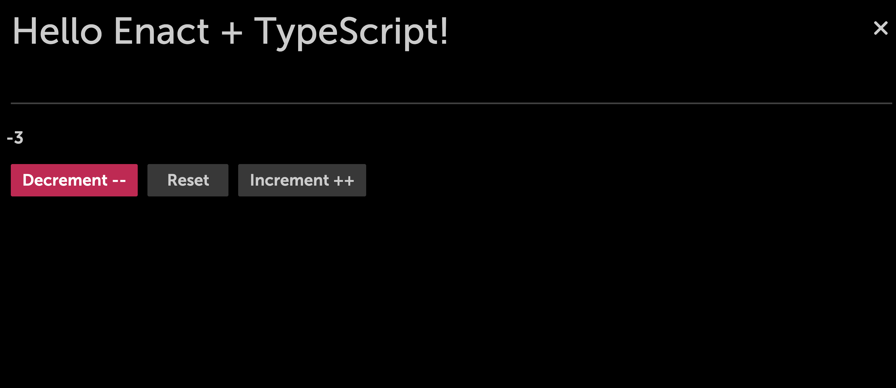

### Counter Component using TypeScript with Enact

We can use the same **Counter.tsx** file, replace the previous content with the following:

```ts
//Counter.tsx

import Button from '@enact/moonstone/Button';
import kind from '@enact/core/kind';
import React from 'react';

const CounterBase = kind({
    name: 'Counter',

    defaultProps: {
        count: 0
    },

    render: ({count}) => (
        <div>
            <h1>{count}</h1>
            <Button>Decrement --</Button>
            <Button>Reset</Button>
            <Button>Increment ++</Button>
        </div>
    )
});

export default CounterBase;
```

The above code holds the definition of the `Counter` component. 

Now lets add events on the buttons using `kind()` we are binding `defaultProps`, `render` and all the events together.

> Please check API documentation in the Core Library to know more about [kind](../../../modules/core/kind/) and [handle](../../../modules/core/handle/)

Update the render block with `onClick` event to use the `handler` functions. Add a `handlers` block inside the kind declaration:

```ts
//Counter.tsx

import {adaptEvent, forward, handler} from '@enact/core/handle';
import Button from '@enact/moonstone/Button';
import kind from '@enact/core/kind';
import React from 'react';

const CounterBase = kind({
    name: 'Counter',

    defaultProps: {
        count: 0
    },

    handlers: {
        onDecrementClick: count => count - 1,
        onIncrementClick: count => count + 1,
        onResetClick: count => 0
    },

    render: ({onIncrementClick, onDecrementClick, onResetClick, count, ...rest}) => (
        <div>
            <h1>{count}</h1>
            <Button onClick={onDecrementClick}>Decrement --</Button>
            <Button onClick={onResetClick}>Reset</Button>
            <Button onClick={onIncrementClick}>Increment ++</Button>
        </div>
    )
});

export default CounterBase;

```
### View the Counter in the Browser


- So far we have a component that has `onClick` event but at this point we are unable to manage the state of `count` prop.
For state management on `count` prop will use `ui/Changeable`.

> Applying `Changeable` to a component will pass two additional props: the current value from state and an event callback to invoke when the value changes. For more information, read the [ui/Changeable documentation](../../../modules/ui/Changeable/)

- Create a handle function for click events on the button. The `createHandler` function will take a function as input then use the function to update the `count`. By using `handle` we will forward the call to the callback function (onCounterChange) defined via the configuration object passed to `Changeable`:


```ts
//Counter.tsx

import {adaptEvent, forward, handler} from '@enact/core/handle';
import Changeable from '@enact/ui/Changeable';
import Button from '@enact/moonstone/Button';
import kind from '@enact/core/kind';
import React from 'react';

const createHandler = (fn) => {
    return handle(
        adaptEvent((ev, {count}) => ({
            type: 'onCounterChange',
            count: fn(count)
        }),
        forward('onCounterChange')
        )
    )
}

const CounterBase = kind({
    name: 'Counter',

    defaultProps: {
        count: 0
    },

    handlers: {
        onDecrementClick: createHandler(count => count - 1),
        onIncrementClick: createHandler(count => count + 1),
        onResetClick: createHandler(() => 0)
    },

    render: ({onIncrementClick, onDecrementClick, onResetClick, count, ...rest}) => (
        <div>
            <h1>{count}</h1>
            <Button onClick={onDecrementClick}>Decrement --</Button>
            <Button onClick={onResetClick}>Reset</Button>
            <Button onClick={onIncrementClick}>Increment ++</Button>
        </div>
    )
});


const Counter = Changeable({prop: 'count' , change: 'onCounterChange'}, CounterBase);

//Change the default export to the new `Counter` component
export default Counter;

```
### Counter View in the Browser


Now that the counter is ready using enact. Let's integrate TypeScript types on our props and functions. Inject TypeScript types to the handler and props so the compiler will use the right type while parsing the values for props and functions.

```ts

//Counter.tsx

import {adaptEvent, forward, handler} from '@enact/core/handle';
import Changeable from '@enact/ui/Changeable';
import Button from '@enact/moonstone/Button';
import kind from '@enact/core/kind';
import React from 'react';

interface CounterProps {
    count? : number,
    onCounterChange? : void
}

type handlerFunctionType = (count: number) => number;

const createHandler = (fn: handlerFunctionType) => {
    return handle(
        adaptEvent((ev, {count}) => ({
            type: 'onCounterChange',
            count: fn(count)
        }),
        forward('onCounterChange')
        )
    )
}

const CounterBase = kind<CounterProps>({
    name: 'Counter',

    defaultProps: {
        count: 0
    },

    handlers: {
        onDecrementClick: createHandler(count => count - 1),
        onIncrementClick: createHandler(count => count + 1),
        onResetClick: createHandler(() => 0)
    },

    render: ({onIncrementClick, onDecrementClick, onResetClick, count, ...rest}) => (
        <div>
            <h1>{count}</h1>
            <Button onClick={onDecrementClick}>Decrement --</Button>
            <Button onClick={onResetClick}>Reset</Button>
            <Button onClick={onIncrementClick}>Increment ++</Button>
        </div>
    )
});


const Counter = Changeable({prop: 'count' , change: 'onCounterChange'}, CounterBase);

//Change the default export to the new `Counter` component
export default Counter;

```


### Counter View in the Browser




### Error Handling

Building the Counter app, you might get the following TS error, when `count` is added as a default prop but type is not defined.

```none
TypeScript error: Parameter 'count' implicitly has an 'any' type.
```

In case of above error, you need to explicitly define the `count` type or define the type of `count` in the interface.

```ts
interface CounterProps {
    count? : number
}
```
OR

```ts
let count : number = 0;
```

## Conclusion

Using TypeScript with enact we were able to create a reusable counter component. This tutorial introduced you to interface, assertion and different data types of TypeScript. Integrating TypeScript with Enact helped us to extend our knowledge in using `kind` and `handle` in developing a reusable component..
