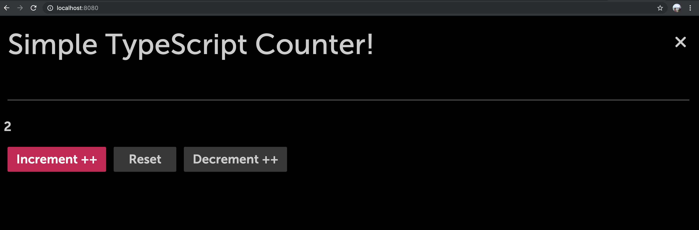

Enact has a number of ready-to-use components. Each component includes TypeScript typing, allowing them to be easily integrated into a project.

Let's start by using components from the Sandstone theme in a stateful React component.

### Creating a Counter Component

- Create a **Counter** folder in **src/components** and add a **Counter.tsx** file

```none
./src/components/Counter/Counter.tsx
```

### Counter using TypeScript

We can now populate the **Counter.tsx** file with a simple counter and add the following contents:

```ts
import React, {useState} from "react";
import Button from "@enact/sandstone/Button";


const Counter:React.FC = () => {
	const [count, setCount] = useState<number>(0);

	function increment() {
		setCount(count + 1);
	}

	function decrement() {
		setCount(count - 1);
	}

	function reset() {
		setCount(0);
	}

	return (
		<div>
			<h1>{count}</h1>
			<Button onClick={decrement}>Decrement --</Button>
			<Button onClick={reset}>Reset</Button>
			<Button onClick={increment}>Increment ++</Button>
		</div>
	);
}

export default Counter;
```

- You'll also need a **package.json** in the same directory to indicate the module's entry point:

```none
./src/components/Counter/package.json
```

```json
{
    "main": "Counter.tsx"
}
```

Then, inside of **views/MainPanel.tsx**, we can import the `Counter` component:

```ts
// Custom component
import Counter from "../components/Counter";

const MainPanel = kind({
  name: "MainPanel",

  render: props => (
    <Panel {...props}>
      <Header title="Hello Enact + TypeScript!" />
      <Counter />
    </Panel>
  )
});

export default MainPanel;
```

- Run the App in the terminal

```bash
npm run serve
```
### TypeScript Counter in the Browser



**Next: [Component with TypeScript and Enact](../component-with-ts-enact/)**
