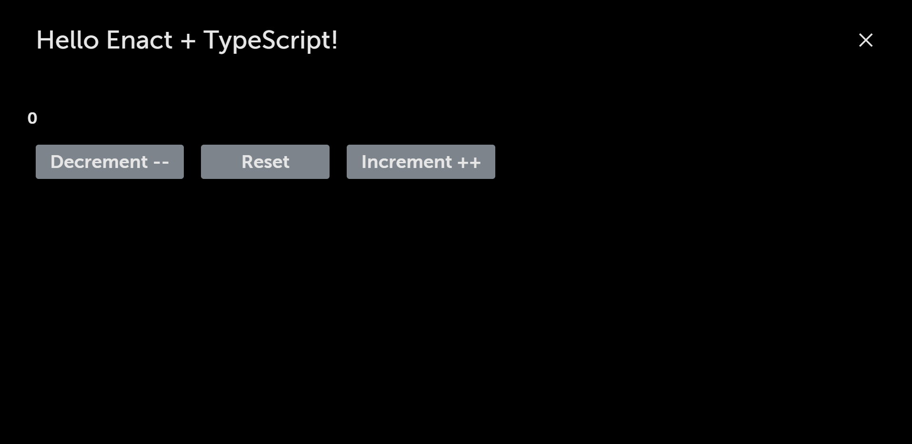

Now we can look at using TypeScript with the Enact `kind()` factory to accomplish the same goal.

### Counter Component using TypeScript with Enact

We can use the same **Counter.tsx** file. Replace the previous contents with the following:

```ts
// Counter.tsx

import Button from '@enact/moonstone/Button';
import kind from '@enact/core/kind';
import React from 'react';

const CounterBase = kind({
    name: 'Counter',

    // Add propTypes until we replace with interface?

    defaultProps: {
        count: 0
    },

    render: ({onIncrementClick, onDecrementClick, onResetClick, count, ...rest}) => (
        <div {...rest}>
            <h1>{count}</h1>
            <Button onClick={onDecrementClick}>Decrement --</Button>
            <Button onClick={onResetClick}>Reset</Button>
            <Button onClick={onIncrementClick}>Increment ++</Button>
        </div>
    )
});

export default CounterBase;
```

The above code holds the definition of the `Counter` component. This is a simple stateless component that does not leverage any of the features of TypeScript. It relies on the parent managing the state by passing in the event handlers.

> Please check API documentation in the Core Library to know more about [kind](../../../modules/core/kind/).

Let's extend this simple component to be properly typed and add state handling using the reusable higher-order components Enact provides.

### View the Counter in the Browser



### Adding Typing

This does work, mainly because we haven't modified the `MainView` component to pass the additional props this component needs. If we did, we would likely get TypeScript errors because the props we are expecting aren't typed. Let's add an interface to `CounterBase` that will describe the props we expect:

```ts
// Counter.tsx

import Button from '@enact/moonstone/Button';
import kind from '@enact/core/kind';
import React, {MouseEvent} from 'react';

interface Props {
	count? : number,
	onDecrementClick? : (ev: MouseEvent) => void,
	onIncrementClick? : (ev: MouseEvent) => void,
	onResetClick? : (ev: MouseEvent) => void
}

const CounterBase = kind<Props>({
    name: 'Counter',

    defaultProps: {
        count: 0
    },

    render: ({onIncrementClick, onDecrementClick, onResetClick, count, ...rest}: Props) => (
        <div {...rest}>
            <h1>{count}</h1>
            <Button onClick={onDecrementClick}>Decrement --</Button>
            <Button onClick={onResetClick}>Reset</Button>
            <Button onClick={onIncrementClick}>Increment ++</Button>
        </div>
    )
});

export default CounterBase;
```

> Note: We've left the event handlers optional so we don't have to update **App.js** and we'll be replacing them in the next section.

### Counter View in the Browser


### Adding State Handling

- So far we have a component that has `onClick` event but at this point we are unable to manage the state of `count` prop.

For state management on `count` prop will use `ui/Changeable`.

> Applying `Changeable` to a component will pass two additional props: the current value from state and an event callback to invoke when the value changes. For more information, read the [ui/Changeable documentation](../../../modules/ui/Changeable/)

- Create a handle function for click events on the button. The `createHandler` function will take a function as input then use the function to update the `count`. By using `handle()` we will forward the call to the callback function (`onCounterChange`) defined via the configuration object passed to `Changeable`:

```ts
//Counter.tsx

import {adaptEvent, forward, handler} from '@enact/core/handle';
import Changeable from '@enact/ui/Changeable';
import Button from '@enact/moonstone/Button';
import kind from '@enact/core/kind';
import React from 'react';

interface Props {
    count? : number,
    onCounterChange? : void
}

type HandlerFunctionType = (count: number) => number;

const createHandler = (fn: HandlerFunctionType) => {
    return handle(
        adaptEvent((ev, {count}) => ({
            type: 'onCounterChange',
            count: fn(count)
        }),
        forward('onCounterChange')
        )
    )
};

const CounterBase = kind<Props>({
    name: 'Counter',

    defaultProps: {
        count: 0
    },

    handlers: {
        onDecrementClick: createHandler(count => count - 1),
        onIncrementClick: createHandler(count => count + 1),
        onResetClick: createHandler(() => 0)
    },

    render: ({onIncrementClick, onDecrementClick, onResetClick, count, ...rest}) => (
        <div {...rest}>
            <h1>{count}</h1>
            <Button onClick={onDecrementClick}>Decrement --</Button>
            <Button onClick={onResetClick}>Reset</Button>
            <Button onClick={onIncrementClick}>Increment ++</Button>
        </div>
    )
});

const Counter = Changeable({prop: 'count' , change: 'onCounterChange'}, CounterBase);

//Change the default export to the new `Counter` component
export default Counter;
```

> Note: The `createHandler` function is simply a shortcut to allow us to avoid duplicating the same piece of code three times (once for each of the events we need to handle). What the code does is take a function that modifies the `count` value and returns the new value. It takes the incoming click event and then creates a new event to pass to the `onCounterChange` event from `Changeable`, passing it the value modified by the function.

> Note: Because the `onCounterChange` event is being supplied by `Changeable`, we'll mark it as optional since we don't want it to be required from its parent.

### Counter View in the Browser


### Error Handling

Building the Counter app, you might get the following TS error, when `count` is added as a default prop but type is not defined.

```none
TypeScript error: Parameter 'count' implicitly has an 'any' type.
```

In case of above error, you need to explicitly define the `count` type or define the type of `count` in the interface.

```ts
interface IProps {
    count? : number
}
```

OR

```ts
let count : number = 0;
```

## Conclusion

Using TypeScript with Enact we were able to create a reusable counter component. Integrating TypeScript with Enact helped us to extend our knowledge in using `kind()` and `handle()` in developing a reusable component.
